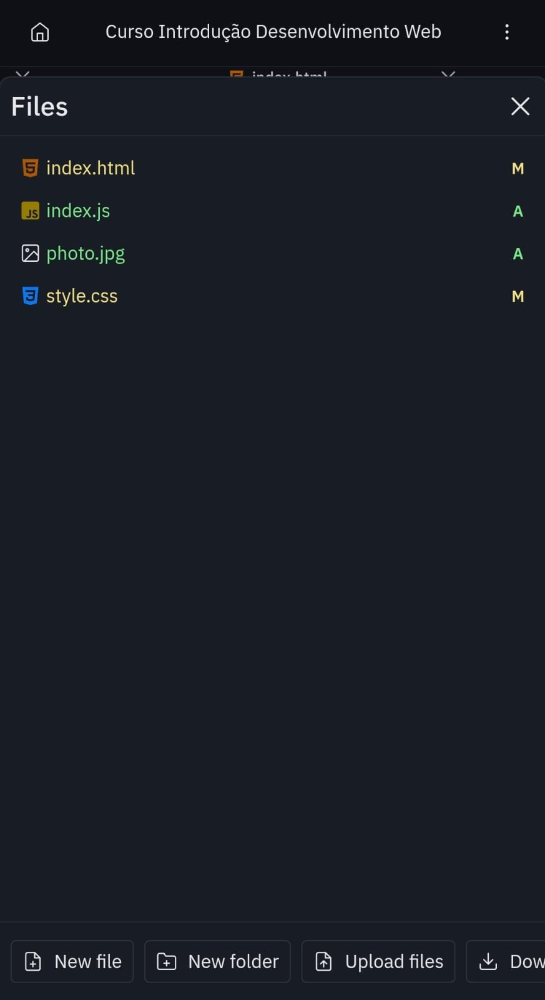

# 🌐 Página Web – Introdução ao Desenvolvimento Web

Projeto desenvolvido durante a disciplina complementar Introdução ao Desenvolvimento Web, da Faculdade Descomplica.  
O objetivo foi criar uma página interativa aplicando conceitos básicos de HTML, CSS e JavaScript.

---

## 📌 Tecnologias Utilizadas
- HTML5 – Estrutura da página  
- CSS3 – Estilização e layout  
- JavaScript – Interatividade e manipulação de elementos

---

## 📷 Capturas de Tela do Projeto
### 1. Estrutura de Arquivos

### 2. HTML
[HTML do Projeto](html.jpg)

### 3. CSS
[CSS do Projeto](css.jpg)(css2.jpg)

### 4. JavaScript
[JavaScript do Projeto](javascript.jpg)

### 2. Página Final

---

## 💻 Como Funciona
1. O usuário digita seu nome no campo de texto.  
2. Ao clicar em Entrar, aparece uma mensagem:  
   “Bem-vindo, [nome do usuário]!”  
3. Ao clicar em Sair, a mensagem desaparece.

---

## 🌍 Acesse o Projeto Online
🔗 **[Clique aqui para visualizar](https://e45746a3-5e75-4efe-ae83-a48c759f4d14-00-346seqztljike.worf.replit.dev/)**

---

## 🏆 Sobre o Projeto
Este projeto demonstra:  
- Estruturação de páginas com HTML  
- Estilização com CSS  
- Interatividade com JavaScript
